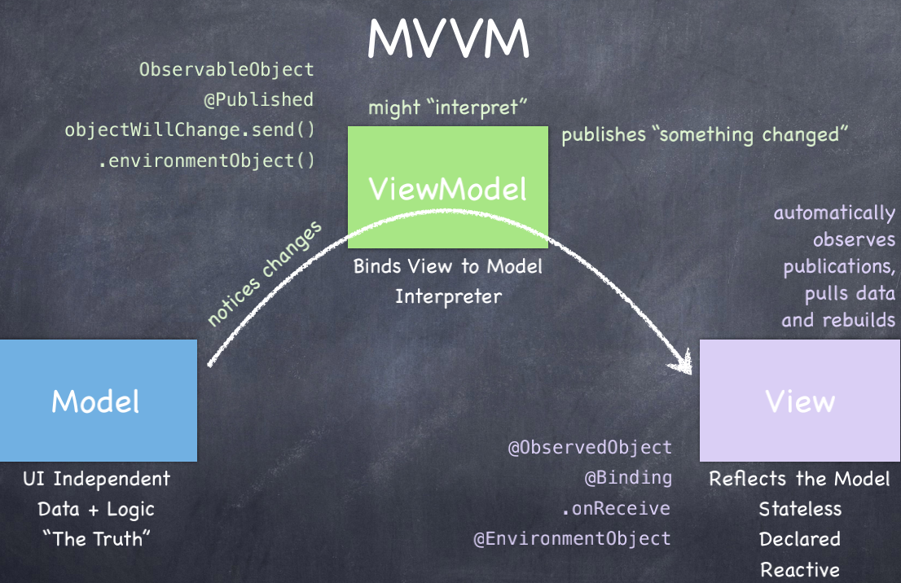

# swiftui
- <a href="#p1">MVVM and the Swift Type System</a>
---
## <a id="p1">MVVM and the Swift Type System</a>  
MVVM: Model-View-viewModel,和旧版本的UIKit的MVC是有所不同的。其实MVVM本质上就是MVC的改进版也就是"模型-视图-视图模型"，模型指的是后端传递的数据。视图就是看到的页面，视图模型就是MVVM的核心，它是连接view和model的桥梁，它有两个方向，一个是将模型转为视图，也就是把后端传递的数据转化成所看到的页面，实现的方式就是数据绑定。二是将视图转换为模型，即将所看到的页面转化成后端的数据。试下的方式是：DOM事件监听，这两个方向都实现的，我们称之为数据的双向绑定。  
也就是说在MVVM框架中视图和模型不能直接交互，它们会通过ViewModel来通信。  
